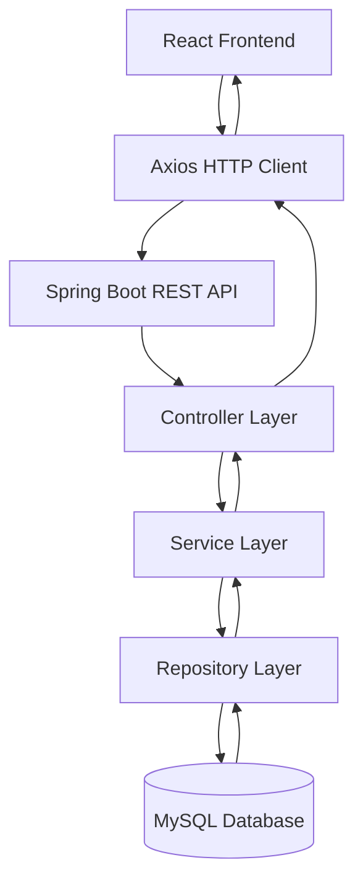
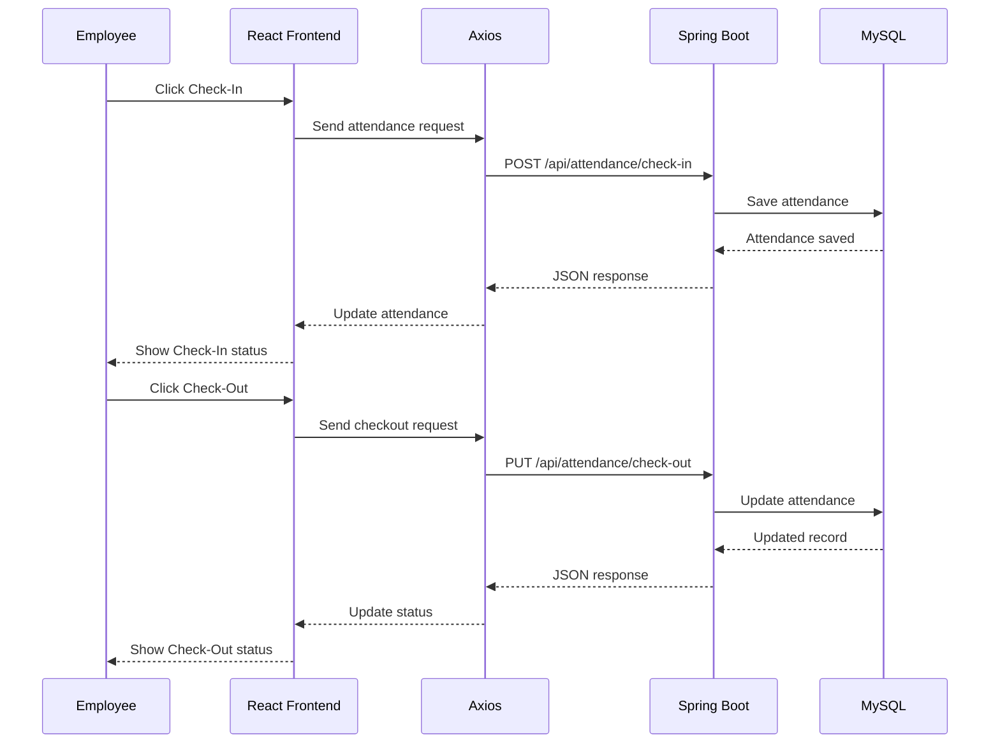

# ⏱️ TimeFlow — Employee Attendance Management System

<p align="center">
  
  
  
  
  
  
</p>

<p align="center">
  <b>A modern full-stack web application for managing employees, tracking attendance, and generating attendance reports.</b>
</p>

---

## 📌 Project Overview

**TimeFlow** is a full-stack **Employee Attendance Management System** designed to provide a centralized platform for managing employee information and attendance records.

The system provides separate experiences for **Administrators** and **Employees**. Administrators can manage employee information, monitor attendance, and generate reports, while employees can view their personal information and attendance details.

The application uses a **React frontend**, **Spring Boot REST API backend**, and **MySQL database**.

---

## 🎯 Objectives

- Digitize employee attendance management.
- Reduce manual attendance record keeping.
- Provide employee and attendance management through a centralized system.
- Enable employee check-in and check-out.
- Generate monthly attendance reports.
- Provide separate administrator and employee dashboards.
- Provide a responsive and user-friendly interface.
- Connect the frontend and backend through REST APIs.

---

## ✨ Features

### 👑 Administrator

- Admin dashboard
- View total employees
- Monitor today's attendance
- Monitor pending check-outs
- View absent employee count
- Add new employees
- Manage employee records
- View employee details
- Filter employees by department
- View attendance reports
- Export attendance records as CSV
- View monthly attendance statistics

### 👤 Employee

- Employee dashboard
- View personal profile
- View employee ID and department
- View today's attendance status
- View check-in time
- View monthly work days
- View total working hours
- Check in and check out
- View personal attendance reports

### 📊 Attendance Reporting

The reporting module provides:

- Total work days
- Present days
- Half days
- Absent days
- Total work hours
- Average work hours
- Daily attendance logs
- Check-in time
- Check-out time
- Attendance status
- CSV export for administrators

---

# 🏗️ System Architecture



### Architecture Flow

```text
React Frontend
      ↓
Axios HTTP Client
      ↓
Spring Boot REST API
      ↓
Controller Layer
      ↓
Service Layer
      ↓
Repository Layer
      ↓
MySQL Database
```

---

# 🛠️ Technology Stack

## Frontend

| Technology | Purpose |
|---|---|
| React 18.2.0 | User interface |
| JavaScript | Frontend programming |
| CSS | Styling and responsive design |
| React Router | Client-side navigation |
| Axios | REST API communication |
| React Testing Library | Frontend testing |
| Jest | JavaScript testing |

## Backend

| Technology | Purpose |
|---|---|
| Java 17 | Backend programming |
| Spring Boot | Backend framework |
| Spring Web | REST API development |
| Spring Data JPA | Database access |
| Hibernate | Object-relational mapping |
| Maven | Dependency and build management |

## Database

| Technology | Purpose |
|---|---|
| MySQL | Relational database |
| JPA/Hibernate | Object-relational mapping |

## Development & Deployment Tools

- Visual Studio Code
- Git
- GitHub
- GitHub Actions
- Vercel
- Maven
- npm

---

# 📂 Project Structure

```text
EMPLOYEE-ATTANDANCE-MANAGER-SYSTEM/
│
├── reactapp/
│   │
│   ├── public/
│   │
│   ├── src/
│   │   ├── components/
│   │   │   ├── AttendanceReport.jsx
│   │   │   ├── Dashboard.jsx
│   │   │   ├── EmployeeDetails.jsx
│   │   │   ├── EmployeeForm.jsx
│   │   │   ├── EmployeeList.jsx
│   │   │   └── ...
│   │   │
│   │   ├── utils/
│   │   │   └── api.js
│   │   │
│   │   ├── App.js
│   │   ├── App.css
│   │   └── index.js
│   │
│   ├── package.json
│   ├── package-lock.json
│   └── vercel.json
│
├── src/
│   └── main/
│       ├── java/
│       │   └── ...
│       │
│       └── resources/
│           └── application.properties
│
├── pom.xml
└── README.md
```

---


# 🧩 Main Modules

## 1. User Management

Provides user-specific access and separates administrator and employee experiences.

```text
Administrator
     │
     ├── Employee Management
     ├── Attendance Monitoring
     └── Attendance Reports

Employee
     │
     ├── Personal Dashboard
     ├── Check-In / Check-Out
     └── Personal Attendance Report
```

---

## 2. Employee Management

Administrators can manage employee information including:

- Employee ID
- Name
- Email
- Department
- Position
- Joining Date

---

## 3. Attendance Management

The attendance module provides:

```text
Employee
   ↓
Check-In
   ↓
Attendance Record
   ↓
Check-Out
   ↓
Working Hours
```

---

## 4. Attendance Reporting

Administrators and employees can view attendance reports based on:

- Employee
- Year
- Month

Reports contain daily attendance information and monthly statistics.

---

# 🔌 REST API

The frontend communicates with the Spring Boot backend using REST APIs.

## Employee APIs

### Get All Employees

```http
GET /api/employees
```

### Filter Employees by Department

```http
GET /api/employees?department={department}
```

### Get Employee

```http
GET /api/employees/{employeeId}
```

### Create Employee

```http
POST /api/employees
```

---

## Attendance APIs

### Check-In

```http
POST /api/attendance/check-in
```

### Check-Out

```http
PUT /api/attendance/check-out
```

### Attendance Report

```http
GET /api/attendance/report
```

Example:

```text
/api/attendance/report?employeeId=EMP001&year=2026&month=9
```

---

# 🗄️ Database

The application uses **MySQL** as the relational database.

## Employee

```text
Employee
├── id
├── employeeId
├── name
├── email
├── department
├── position
└── joiningDate
```

## Attendance

```text
Attendance
├── id
├── employeeId
├── attendanceDate
├── checkInTime
├── checkOutTime
├── status
└── workHours
```

---

# 🔄 Attendance Workflow



---

# 📊 Dashboard

## Administrator Dashboard


The administrator dashboard provides an overview of:

- Total employees
- Present employees
- Pending check-outs
- Absent employees
- Recent employees
- Quick management actions

## Employee Dashboard


The employee dashboard provides:

- Today's attendance status
- Check-in time
- Monthly work days
- Total hours logged
- Personal profile
- Attendance report access

---

# 📥 CSV Export

Administrators can export attendance reports in CSV format.


The exported report contains:

- Employee ID
- Employee Name
- Date
- Check In Time
- Check Out Time
- Status
- Work Hours

Example:

```csv
Employee ID,Employee Name,Date,Check In Time,Check Out Time,Status,Work Hours
EMP001,"John Doe",2026-09-28,09:00,17:30,Present,8.5
```

---
# 🔄 CI/CD

The project uses **GitHub Actions** for automated build validation.

The CI pipeline performs:

```text
Git Push
   ↓
GitHub Actions
   ↓
Install Dependencies
   ↓
Build Frontend
   ↓
Build Backend
   ↓
Run Tests
   ↓
Build Successful
```

## Frontend Build

```bash
npm run build
```

## Backend Build

```bash
mvn clean package
```

The React production build has been successfully validated using:

```bash
npm run build
```

---

# 🚀 Running the Project Locally

## Prerequisites

Make sure you have installed:

- Java 17
- Maven
- Node.js
- npm
- MySQL
- Git

---

## 1. Clone Repository

```bash
git clone https://github.com/suhaillink/EMPLOYEE-ATTANDANCE-MANAGER-SYSTEM.git
```

```bash
cd EMPLOYEE-ATTANDANCE-MANAGER-SYSTEM
```

---

## 2. Configure MySQL

Create the database:

```sql
CREATE DATABASE app_db;
```

Configure the backend database connection in:

```text
src/main/resources/application.properties
```

Example:

```properties
spring.datasource.url=jdbc:mysql://localhost:3306/app_db?createDatabaseIfNotExist=true
spring.datasource.username=root
spring.datasource.password=your_password

spring.jpa.hibernate.ddl-auto=create
spring.jpa.show-sql=true

server.port=8080
```

> Replace `your_password` with your local MySQL password.

---

## 3. Start Spring Boot Backend

From the backend project directory:

```bash
mvn spring-boot:run
```

Backend runs on:

```text
http://localhost:8080
```

---

## 4. Start React Frontend

Open another terminal:

```bash
cd reactapp
```

Install dependencies:

```bash
npm install
```

Start the frontend:

```bash
npm start
```

The React application will run on:

```text
http://localhost:8081
```

---
## 🔐 Demo Admin Login

For testing the application locally after cloning the repository, use the following administrator credentials:

| Field | Value |
|---|---|
| **Email** | `admin@gmail.com` |
| **Password** | `admin123` |
| **Role** | `ADMIN` |

### Login

1. Start the Spring Boot backend.
2. Start the React frontend.
3. Open:

`http://localhost:8081`

4. Go to the Login page.
5. Enter:

```text
Email: admin@gmail.com
Password: admin123
```
---
# 🌐 Deployment

The frontend can be deployed using **Vercel**.

The project includes:

```text
reactapp/vercel.json
```

for client-side routing.

## Build Command

```bash
npm run build
```

## Output Directory

```text
build
```

## Vercel Configuration

```json
{
  "rewrites": [
    {
      "source": "/(.*)",
      "destination": "/index.html"
    }
  ]
}
```

---

# 🔐 Configuration

The frontend API configuration is maintained in:

```text
reactapp/src/utils/api.js
```

The backend server configuration is maintained in:

```text
src/main/resources/application.properties
```

For production deployment, configure the API URL according to the deployed backend environment.

---
# 👨‍💻 Developer

**Mohammed Suhail M**

**Computer Science and Design**  
Sri Krishna College of Engineering and Technology

---

# 📜 License

This project is developed for academic and educational purposes.

---

# ⭐ Project

If you find this project useful, consider giving the repository a ⭐ on GitHub.

## ⏱️ TimeFlow — Smart Employee Attendance Management System

> Simplifying employee attendance management through a modern full-stack web application.
